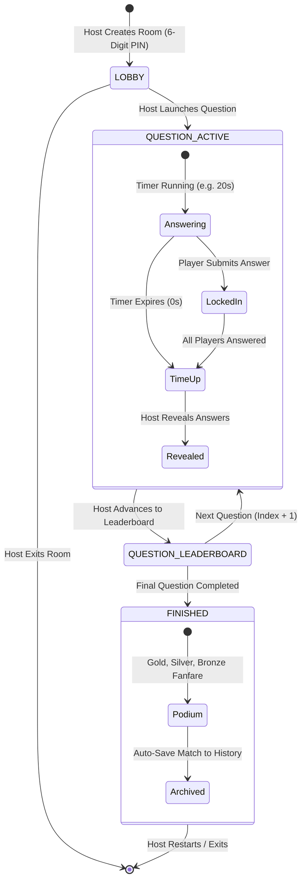

# ⚡ PulseQuiz Live

<p align="center">
  
</p>

<p align="center">
  <strong>A high-performance, real-time interactive live quiz platform built for modern classrooms, tech meetups, and live events.</strong>
</p>

<p align="center">
  
  
  
  
  
  
  
</p>

---

## 📖 Table of Contents

- [Overview](#-overview)
- [Key Features](#-key-features)
  - [1. Host Presenter Studio](#1-host-presenter-studio)
  - [2. Mobile-First Player Experience](#2-mobile-first-player-experience)
  - [3. Dual-Engine Real-Time Sync](#3-dual-engine-real-time-sync)
  - [4. AI Quiz Generator (Gemini 2.5)](#4-ai-quiz-generator-gemini-25)
  - [5. Quiz Creator & Saved Library](#5-quiz-creator--saved-library)
  - [6. Flexible Media & Hint Storage](#6-flexible-media--hint-storage)
  - [7. Web Audio API Synthesizer](#7-web-audio-api-synthesizer)
- [Architecture & State Machine](#-architecture--state-machine)
- [Tech Stack](#-tech-stack)
- [Directory Structure](#-directory-structure)
- [Quick Start](#-quick-start)
  - [Prerequisites](#prerequisites)
  - [Installation](#installation)
  - [Running Locally](#running-locally)
- [Configuration & Environment Variables](#-configuration--environment-variables)
- [Image Storage Options](#-image-storage-options)
- [Deployment](#-deployment)
  - [Deploying on Vercel](#deploying-on-vercel)
  - [Deploying on Firebase Hosting](#deploying-on-firebase-hosting)
- [License](#-license)

---

## 🌟 Overview

**PulseQuiz** delivers a real-time, Kahoot- and Mentimeter-inspired interactive quiz experience with an executive, modern **shadcn/ui dark zinc aesthetic**. Designed from the ground up for minimal latency, zero-setup onboarding, and mobile responsiveness, PulseQuiz allows presenters to host multiplayer trivia games with up to 200+ concurrent players effortlessly.

Whether you are hosting an offline classroom workshop or a global virtual event, PulseQuiz seamlessly handles synchronized countdowns, live response distribution graphs, dynamic speed-bonus scoring, interstitial leaderboards, and confetti podium ceremonies.

---

## 🚀 Key Features

### 1. Host Presenter Studio
- **Passcode Protected**: Host controls are secured behind a configurable passcode (`admin123` by default) and completely isolated from public player views.
- **6-Digit Game PIN & QR Code**: Players can join via code or by scanning an auto-generated QR code ([`qrcode.react`](https://github.com/zpao/qrcode.react)) with their phone camera.
- **200-Player Load Simulator**: Built-in mock bot simulator with `+10`, `+50`, and `+200` buttons to stress-test live room synchronization with realistic latency and randomized distribution.
- **Live Response Distribution Chart**: Real-time animated bar chart showing submission counts across all 4 choices as players lock in their answers.
- **Presenter Controls**: Synchronized countdown timer, manual answer reveal, score recalculation, and interstitial leaderboard.
- **Final 3D Podium**: Gold 🥇, Silver 🥈, and Bronze 🥉 podium celebration with sound effects and canvas confetti fireworks.
- **Match History & Report Export**: Tournament results are archived automatically, with 1-click **Download JSON Report** for post-game analytics.

### 2. Mobile-First Player Experience
- **Instant Join**: No login required. Enter a 6-digit PIN (or join via URL `/?code=XXXXXX`), choose a nickname, and pick a custom avatar.
- **Auto-Reconnection**: Reconnects players automatically if their browser tab is refreshed or connection briefly drops.
- **Tactile Gameplay Interface**: 4 responsive, high-contrast matte answer blocks:
  - 🔺 **Red Triangle** (`#dc2626`)
  - 🔷 **Blue Diamond** (`#2563eb`)
  - 🟡 **Amber Circle** (`#d97706`)
  - 🟩 **Green Square** (`#16a34a`)
- **Required Hint Image Display**: Displays question text and visual clue images directly on the player's screen with a **1-click Full Screen Lightbox Zoom** modal.
- **Kahoot Speed-Bonus Formula**: Awards up to 1,000 points per question based on reaction time and accuracy:
  $$\text{Points} = \text{round}\left(1000 \times \left(1 - \frac{\text{Time Spent}}{2 \times \text{Total Time}}\right)\right)$$
- **Round Feedback**: Instant score display with streak counters (`🔥 Streak x3`) and rank tracking (`#2 of 24`).

### 3. Dual-Engine Real-Time Sync
PulseQuiz features a resilient dual-engine synchronization architecture:
- **Cloud Mode (Firebase Realtime Database)**: Sub-50ms synchronized state across disparate devices and networks via WebSockets.
- **Zero-Config Fallback (BroadcastChannel & LocalStorage)**: Works immediately out-of-the-box across browser tabs without needing Firebase credentials or cloud configuration.

### 4. AI Quiz Generator (Gemini 2.5)
- Powered by the `@google/genai` SDK using `gemini-2.5-flash`.
- Generates up to **50 customized questions** on any topic with configurable difficulty levels (`easy`, `medium`, `hard`).
- Enforces strict JSON Schema generation for zero parsing errors.
- Bundles pre-built curated sample quizzes (*Web Dev Mastery*, *Space & Cosmos*, *World Geography*).

### 5. Quiz Creator & Saved Library
- **Up to 50 Questions**: Build, reorder, duplicate, and edit comprehensive quizzes.
- **Dual Persistence**: Saves quizzes to both Firebase Realtime Database (`/saved_quizzes`) and `localStorage` for offline editing.
- **Quiz Management**: 1-click **Host Live**, **Edit**, or **Delete** saved quizzes from the executive Quiz Library dashboard.

### 6. Flexible Media & Hint Storage
- **ImgBB Integration**: Seamless 1-click upload to [ImgBB](https://api.imgbb.com/) CDN with 100% original pixel quality and natural aspect ratio.
- **Instant Client-Side Compression**: Embedded canvas-based WebP/JPEG compressor (<20ms) for instant zero-config uploads.
- **Direct Image URLs**: Supports pasting public links from Unsplash, Google Images, or Wikimedia with live preview error detection.
- **Enterprise AWS S3 Support**: Serverless pre-signed URL endpoint (`/api/s3-presign.js`) for AWS S3 private-credential bucket uploads.

### 7. Web Audio API Synthesizer
- Built using native browser **Web Audio API** (`src/services/audio.js`) with zero audio assets to load.
- Provides tactile click feedback, countdown ticking, time-up buzzers, harmonic major chords for correct answers, dissonance buzzers for incorrect answers, and brass fanfare for podium winners.
- Global mute toggle in the navigation bar.

---

## 🏗️ Architecture & State Machine



---

## 🛠️ Tech Stack

| Layer | Technology | Description |
| :--- | :--- | :--- |
| **Frontend Framework** | React 19 (`react`, `react-dom`) | Modern component architecture with Hooks |
| **Build Tool** | Vite 8 (`vite`, `@vitejs/plugin-react`) | Sub-second HMR & optimized production bundling |
| **Styling & Design** | Tailwind CSS v4 + `@tailwindcss/vite` | Modern CSS engine with dark zinc design tokens |
| **UI Components** | [shadcn/ui](https://ui.shadcn.com/) primitives | Accessible `Button`, `Card`, `Badge`, `Input`, `Dialog` |
| **Realtime Database** | Firebase Realtime Database 12 (`firebase`) | Low-latency state synchronization (`/rooms/{pin}`) |
| **Artificial Intelligence** | Google Gemini 2.5 (`@google/genai`) | AI-assisted structured quiz generation |
| **Cloud Storage** | ImgBB / AWS S3 SDK / Cloudinary | Multi-provider image hint hosting |
| **Icons & Visuals** | Lucide React (`lucide-react`) | Crisp, lightweight SVG iconography |
| **Audio Synthesis** | Web Audio API | Zero-latency algorithmic procedural sound FX |
| **FX & Celebration** | Canvas Confetti (`canvas-confetti`) | Physics-based particle fireworks on final podium |

---

## 📂 Directory Structure

```
quiz-web/
├── api/
│   └── s3-presign.js             # Vercel serverless function for S3 pre-signed URLs
├── public/
│   └── favicon.ico               # Application favicon
├── src/
│   ├── assets/                   # Static images & branding assets
│   ├── components/
│   │   ├── Common/
│   │   │   ├── AnswerButton.jsx  # 4 Kahoot colored buttons with stats
│   │   │   ├── ConfigModal.jsx   # In-app settings (Firebase, Gemini, ImgBB)
│   │   │   ├── Navbar.jsx        # Navigation bar with sound & host switcher
│   │   │   └── QRModal.jsx       # Scannable join QR code modal
│   │   ├── Host/
│   │   │   ├── AIGeneratorModal.jsx # Gemini AI quiz generator modal
│   │   │   ├── HostAuthModal.jsx # Passcode security gatekeeper
│   │   │   ├── HostControl.jsx   # Active presenter screen with bar charts
│   │   │   ├── HostDashboard.jsx # Quiz studio library & event launcher
│   │   │   ├── HostLeaderboard.jsx # Interstitial rankings & final podium
│   │   │   ├── HostLobby.jsx     # Waiting lobby with PIN & bot simulator
│   │   │   ├── QuizEditor.jsx    # 50-question creator with media upload
│   │   │   └── QuizHistoryModal.jsx # Match archive & JSON report export
│   │   ├── Student/
│   │   │   ├── JoinForm.jsx      # PIN input, nickname & avatar picker
│   │   │   ├── StudentGameView.jsx # Answering interface with visual hint zoom
│   │   │   ├── StudentLobby.jsx  # Live participant waiting room
│   │   │   ├── StudentPodium.jsx # Personal trophy & final score view
│   │   │   └── StudentScoreView.jsx # Round speed bonus & ranking feedback
│   │   └── ui/                   # Modular shadcn/ui components
│   │       ├── badge.jsx
│   │       ├── button.jsx
│   │       ├── card.jsx
│   │       ├── dialog.jsx
│   │       └── input.jsx
│   ├── data/
│   │   └── sampleQuizzes.js      # Built-in curated quizzes
│   ├── hooks/
│   │   ├── useQuizTimer.js       # Synchronized drift-compensated timer
│   │   └── useRoomSync.js        # Real-time room state subscriber
│   ├── lib/
│   │   └── utils.js              # Class merging utility (`cn`)
│   ├── services/
│   │   ├── audio.js              # Web Audio API sound synthesizer
│   │   ├── firebase.js           # Dual-Engine: Firebase RTDB & Broadcast Sync
│   │   ├── gemini.js             # Gemini AI JSON structured quiz engine
│   │   ├── mockBots.js           # 200-player concurrent load simulator
│   │   └── storage.js            # ImgBB, S3, and client-side image compression
│   ├── App.jsx                   # Role routing & state machine orchestrator
│   ├── index.css                 # Dark zinc theme tokens & micro-animations
│   └── main.jsx                  # Application entry point
├── .env.example                  # Environment configuration template
├── database.rules.json           # Firebase Realtime Database security rules
├── firebase.json                 # Firebase Hosting configuration
├── package.json                  # Dependencies and scripts
├── vercel.json                   # Vercel rewrites and serverless config
└── vite.config.js                # Vite configuration with Tailwind CSS & S3 dev proxy
```

---

## ⚡ Quick Start

### Prerequisites

- [Node.js](https://nodejs.org/) (version **18.0.0** or higher)
- [npm](https://www.npmjs.com/) or [pnpm](https://pnpm.io/)

### Installation

1. **Clone the repository**:
   ```bash
   git clone https://github.com/your-username/pulsequiz.git
   cd pulsequiz
   ```

2. **Install dependencies**:
   ```bash
   npm install
   ```

### Running Locally

Start the local Vite development server:
```bash
npm run dev
```

Open your browser and navigate to:
- **Participant View**: [`http://localhost:5173/`](http://localhost:5173/)
- **Host Studio**: [`http://localhost:5173/?host=true`](http://localhost:5173/?host=true) *(Default Passcode: `admin123`)*

> [!TIP]
> **Zero-Config Out of the Box**: You don't need any API keys or Firebase setup to test PulseQuiz locally. Open a Host window in one browser tab, open a Student window in another tab, and watch them synchronize live via `BroadcastChannel`!

---

## ⚙️ Configuration & Environment Variables

Copy the template configuration file:
```bash
cp .env.example .env
```

Edit your `.env` file with your credentials:

```env
# =============================================================
# 1. Firebase Realtime Database (Multi-Device Cloud Sync)
# =============================================================
VITE_FIREBASE_API_KEY=AIzaSy...
VITE_FIREBASE_AUTH_DOMAIN=your-project.firebaseapp.com
VITE_FIREBASE_DATABASE_URL=https://your-project-default-rtdb.firebaseio.com
VITE_FIREBASE_PROJECT_ID=your-project
VITE_FIREBASE_STORAGE_BUCKET=your-project.firebasestorage.app
VITE_FIREBASE_MESSAGING_SENDER_ID=1234567890
VITE_FIREBASE_APP_ID=1:1234567890:web:abcdef

# =============================================================
# 2. Google Gemini AI Engine (AI Quiz Generator)
# Get a free key at: https://aistudio.google.com/
# =============================================================
VITE_GEMINI_API_KEY=AIzaSy...

# =============================================================
# 3. Media Storage: Option A - ImgBB (Recommended Free CDN)
# Get a free API key in 10s at: https://api.imgbb.com/
# =============================================================
VITE_IMGBB_API_KEY=your_imgbb_api_key

# =============================================================
# 4. Media Storage: Option B - AWS S3 (Serverless Pre-signed)
# =============================================================
AWS_ACCESS_KEY_ID=AKIA...
AWS_SECRET_ACCESS_KEY=...
AWS_REGION=us-east-1
AWS_S3_BUCKET_NAME=my-pulsequiz-bucket

# =============================================================
# 5. Host Studio Security
# =============================================================
VITE_HOST_PASSWORD=admin123
```

> [!NOTE]
> All settings can also be modified in-app by clicking the **Settings (Gear)** icon in the host navigation bar without modifying code.

---

## 🖼️ Image Storage Options

PulseQuiz supports 4 methods for attaching question hint images:

| Method | Setup Time | Cost | Best For |
| :--- | :--- | :--- | :--- |
| **Instant Client Compression** | **0 seconds** | Free | Offline use, instant local file uploads with zero setup |
| **ImgBB API** | **30 seconds** | Free | Hosting full-resolution images on a fast global CDN |
| **Public Image URL** | **0 seconds** | Free | Pasting images directly from Unsplash, Google Images, or Wikimedia |
| **AWS S3** | **5 minutes** | AWS Tier | Enterprise private buckets using pre-signed serverless URLs |

---

## 🚀 Deployment

### Deploying on Vercel

PulseQuiz is optimized for seamless deployment on **Vercel**:

1. Push your repository to GitHub / GitLab.
2. Import the project into [Vercel](https://vercel.com).
3. Under **Settings ➔ Environment Variables**, add your keys (`VITE_FIREBASE_API_KEY`, `VITE_GEMINI_API_KEY`, etc.).
4. Deploy! Vercel will automatically configure SPA routing via [`vercel.json`](file:///home/adil/Documents/quiz%20web/vercel.json) and compile [`/api/s3-presign.js`](file:///home/adil/Documents/quiz%20web/api/s3-presign.js) as a serverless Lambda function.

### Deploying on Firebase Hosting

To deploy using Firebase Hosting:

1. Install the Firebase CLI:
   ```bash
   npm install -g firebase-tools
   firebase login
   ```
2. Build the production application:
   ```bash
   npm run build
   ```
3. Deploy to Firebase:
   ```bash
   firebase deploy --only hosting
   ```

---

## 📄 License

This project is licensed under the **MIT License** — see the [LICENSE](LICENSE) file for details.

<p align="center">
  Built with ❤️ for interactive learning & real-time live experiences.
</p>
